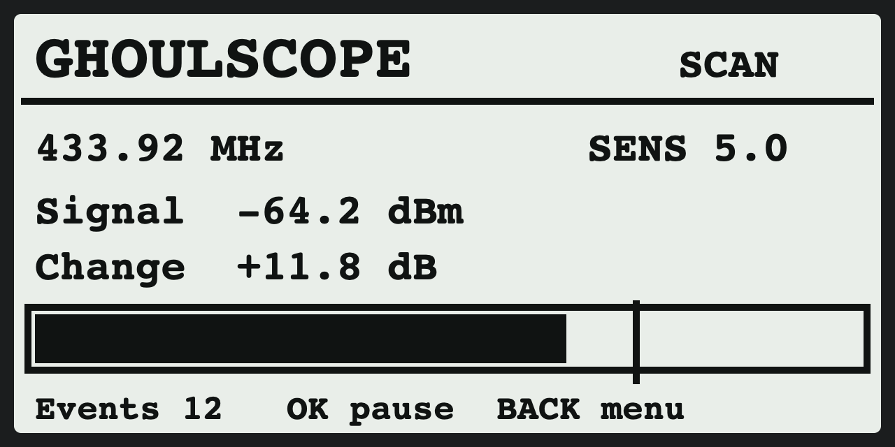
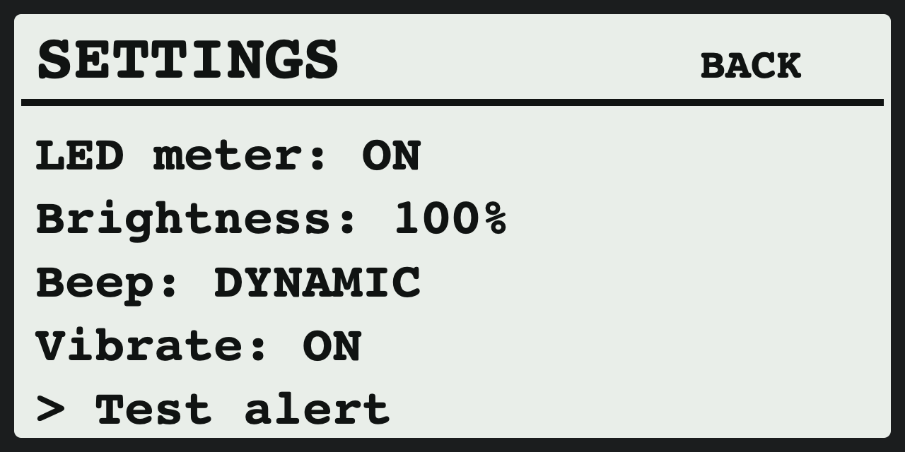
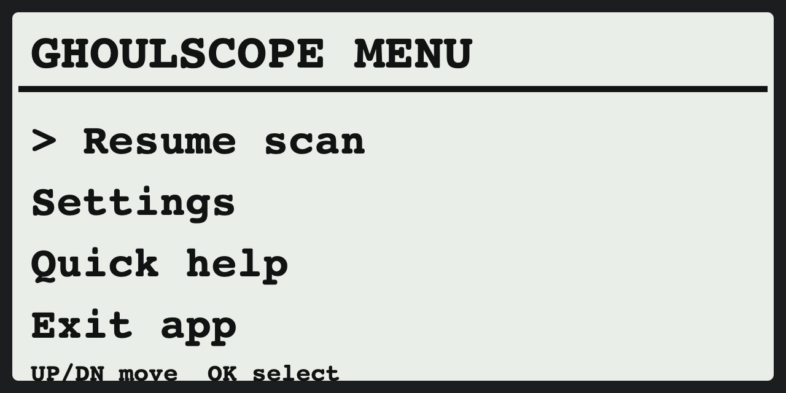

# GhoulScope 👻

> A passive Sub-GHz field and noise meter for Flipper Zero — presented in a ghost-hunting style.



GhoulScope does **not** prove paranormal activity. It measures local changes in Sub-GHz radio energy (RSSI): remote controls, weather stations, smart-home devices, interference, and other electronics can all create events. It never transmits.

## Features

- Passive receiver-only scan on 433.42, 433.92, 434.42 and 868.35 MHz
- Automatic room calibration with slow baseline drift correction
- Adjustable sensitivity and sampling interval
- Clear continuous signal meter with a threshold marker
- RGB LED activity meter: green → yellow → red, with selectable brightness or OFF
- Optional dynamic beep and vibration: stronger activity gives a higher, longer, more frequent alert
- A dedicated **Test alert** that forces a short audible + haptic confirmation, even if the device is in Stealth mode
- CSV logging to the SD card
- On-device Quick Help and a simple menu

## Screens

<p align="center">
  
  
</p>

## Install

1. Download [`GhoulScope.fap`](GhoulScope.fap).
2. In qFlipper, open **File manager** and copy it to `/ext/apps/Ghosts/` on the Flipper SD card.
3. On Flipper, open **Apps → Ghosts → GhoulScope**.
4. Wait for **Learning room** to finish, then watch `Change` and the meter.

This release was compiled and tested on **Momentum Firmware API 87.1**. Other current, API-compatible firmware may also load it, but the included build is specifically verified on Momentum.

## Controls

| Control | Action |
| --- | --- |
| `OK` | Pause / resume scanning |
| `↑` / `↓` | Change sensitivity (smaller dB value = more sensitive) |
| `←` / `→` | Change receive frequency |
| hold `OK` | Start / stop CSV recording |
| hold `↑` | Recalibrate the room |
| hold `↓` | Clear event count |
| hold `←` / `→` | Change sampling interval |
| `Back` | Open menu |
| hold `Back` | Exit safely |

## Settings

Open `Back → Settings`:

- **LED meter** — turn the activity LED off or on.
- **Brightness** — select 12%, 28%, 56% or 100% LED brightness.
- **Beep** — toggle the dynamic sound alert.
- **Vibrate** — toggle haptic alerts independently.
- **Test alert** — plays a clear 280 ms beep + vibration confirmation using the current alert switches. This is useful after changing settings.

The manual test forces the notification output so it remains useful if Flipper’s global Stealth/mute mode is on. Normal scan alerts still follow the two GhoulScope switches above.

## Recordings

Long-press `OK` to write a CSV in:

`/ext/apps_data/ghoul_scope/`

Each row contains the timestamp, frequency, RSSI, baseline, change, and event flag.

## Build

The complete source is in [`src/`](src). Add this folder as a user application to a compatible Flipper firmware tree, then build the external app target:

```sh
./fbt fap_ghoul_scope
```

## Safety and privacy

GhoulScope only observes received radio energy. Use it only where you have permission to monitor the environment, and do not interpret ordinary radio noise as evidence of ghosts.

## License

MIT — see [LICENSE](LICENSE).
